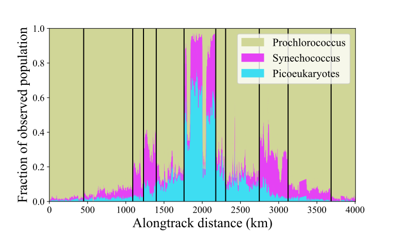

This repository contains companion code for the following paper:

Jones, C., Clayton, S., Ribalet, F., Armbrust, E. V., & Harchaoui, Z. (2021). A kernel-based change detection method to map shifts in phytoplankton communities measured by flow cytometry. *Methods in Ecology and Evolution*, 12, 1687–1698. https://doi.org/10.1111/2041-210X.13647

Introduction
-----------------
In the paper *A Kernel-Based Change Detection Method to Map Shifts in Phytoplankton Communities Measured by Flow Cytometry* we propose an approach to segmenting sequences of point clouds into distinct segments. The approach first generates Hilbertian embeddings for each point cloud. It then segments the data by applying a kernel-based change-point detection method on the embeddings. To estimate the number of change points we propose using auxiliary labeled data.

In the paper we apply this approach to segment flow cytometry data on phytoplankton measured during research cruises. Understanding how phytoplankton communities vary in time and space across ocean basins is critical for predicting how marine ecosystems will respond to future climate change. Phytoplankton account for approximately half of the photosynthesis that occurs on Earth and they thus impact the flux of carbon dioxide into the world's oceans. In addition, they form the basis of the oceanic food web. As such, changes in the distribution and abundance of phytoplankton species both affect and are affected by oceanic changes due to global warming.

The figure below shows estimated change points overlaid on the phytoplankton distribution observed during the cruise KOK1606. Here we limited the number of change points the algorithm searched for to 10 for visualization purposes; in reality, the estimated number was 64. The particle labels used in this figure were not available to the algorithm; the algorithm only used the measurements from the flow cytometer.



In the `examples` folder there is a detailed example of how to apply our proposed method to data from the cruise KOK1606. The results in the paper may be reproduced by running scripts 1-4 in order in the `analysis` folder. See [this page](how_to_reproduce_results.md) for more details.

Data
-----------------
The data used in the analysis may be found at [10.5281/zenodo.4682238](https://doi.org/10.5281/zenodo.4682238). In order to reproduce Figure 1 you will also need the file with the background temperatures, which you can find [here](https://psl.noaa.gov/repository/entry/show?entryid=synth%3Ae570c8f9-ec09-4e89-93b4-babd5651e7a9%3AL25vYWEub2lzc3QudjIuaGlnaHJlcy9zc3QuZGF5Lm1lYW4uMjAxNi52Mi5uYw%3D%3D).


Installation
-----------------
This code is compatible with Python 3.7. It has only been tested on Linux operating systems.

The main dependencies are:

* Basemap http://matplotlib.org/basemap/
* Cartopy https://scitools.org.uk/cartopy/docs/latest/index.html
* Chapydette https://github.com/cjones6/chapydette
* Cython https://cython.org/
* Dateutil https://dateutil.readthedocs.io/en/stable/
* Faiss https://github.com/facebookresearch/faiss
* GSW-Python https://teos-10.github.io/GSW-Python/
* Jupyter https://jupyter.org/
* netCDF4 http://unidata.github.io/netcdf4-python/netCDF4/index.html
* Numba https://numba.pydata.org/
* Numpy https://numpy.org/
* Matplotlib https://matplotlib.org/
* Pandas https://pandas.pydata.org/
* Proj https://proj.org/index.html
* Pyarrow https://arrow.apache.org/docs/python/
* PyTorch https://pytorch.org/
* Scikit-learn https://scikit-learn.org/stable/
* Scipy https://www.scipy.org/
* Seaborn https://seaborn.pydata.org/index.html

The remainder of the dependencies are standard and e.g., come pre-installed with Anaconda. 

If you are using Anaconda you should be able to install the dependencies with the following terminal commands:

First, create a conda environment. We'll call it `chpt`.
```
conda create -n chpt python=3.7
conda activate chpt
```

Next, install the dependencies for Chapydette. The instructions below assume you do not have a GPU. If you do, see the installation instructions for [PyTorch](https://pytorch.org/) and [Faiss](https://github.com/facebookresearch/faiss/blob/master/INSTALL.md).
```
conda install cython numba numpy scipy scikit-learn
conda install pytorch torchvision cpuonly -c pytorch
conda install faiss-cpu -c pytorch
```
In order to compile the Chapydette code you will need to have gcc installed. If you are using Ubuntu, you can install this via
```
sudo apt install build-essential
```
If you are using a Mac, you should install llvm, gcc, and libgcc:
```
conda install llvm gcc libgcc
```

Next, install Chapydette and the remainder of the dependencies. The dependencies basemap, cartopy, and netcdf4 are only used to make the cruise map.
```
git clone https://github.com/cjones6/chapydette  
cd chapydette  
python setup.py install
conda install python-dateutil jupyter nb_conda netcdf4 pandas pyarrow seaborn
conda install basemap
conda install -c conda-forge cartopy gsw
conda install matplotlib=3.1.1 --force
```

Contact
-----------------
You can report issues and ask questions in the repository's issues page. If you choose to send an email instead, please direct it to Corinne Jones at cjones6@uw.edu.

Authors
-----------------
[Corinne Jones](https://www.stat.washington.edu/people/cjones6/)  
[Sophie Clayton](https://www.sophieclayton.com/)  
[François Ribalet](https://armbrustlab.ocean.washington.edu/people/ribalet/)  
[E. Virginia Armbrust](https://armbrustlab.ocean.washington.edu/people/armbrust/)  
[Zaid Harchaoui](http://faculty.washington.edu/zaid/)  

Acknowledgements
-----------------
We thank Chris Berthiaume and Dr. Annette Hynes for their help in processing and curating SeaFlow data. This work was supported by grants from the Simons Foundation (Award ID 574495 to F.R., Award IDs 329108, 426570SP and 549894 to E.V.A.). C.J. acknowledges support from NSF grant DMS-1810975. S.C. acknowledges support from a Moore/Sloan Data Science and Washington Research Foundation Innovation in Data Science Postdoctoral Fellowship. Z.H. acknowledges support from the CIFAR LMB program and NSF grant DMS-1810975. The authors are grateful to the eScience Institute at the University of Washington for supporting this collaboration.
